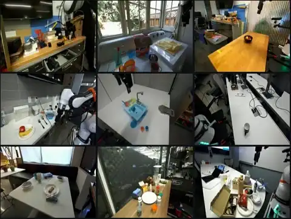
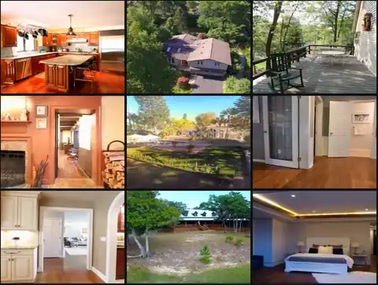
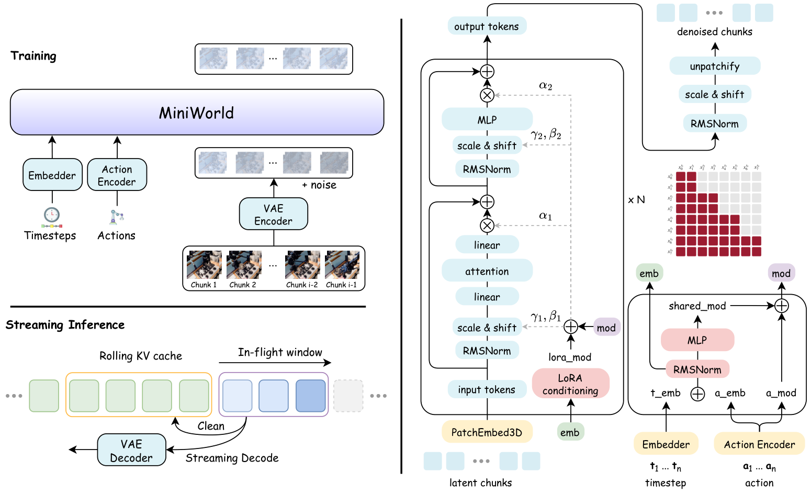

<div align="center">

# MiniWorld

### Democratizing the Training of Video World Models from Scratch

**A minimal, reproducible recipe for action- and pose-conditioned streaming video world models**

<a href="https://zhao-yian.github.io/MiniWorld/"></a>

<a href="https://huggingface.co/zhaoyian01/MiniWorld"></a>

[Installation](#installation) · [Inference](#streaming-inference) · [Training](#training) · [中文](README_zh.md)

</div>

## Introduction

MiniWorld is a compact framework for training **streaming video world models from scratch**. Instead of adapting a pretrained bidirectional video generator, MiniWorld directly learns causal next-state prediction with a block-causal Video Diffusion Transformer and Rectified Flow.

The same architecture supports two control modalities:

- **DROID:** low-level robot actions for embodied world modeling.
- **RealEstate10K:** camera poses for controllable scene prediction.

MiniWorld combines chunk-wise Diffusion Forcing, non-decreasing noise schedules, continued long-context training, and rolling-KV streaming inference. The complete model can be trained in several days on a single 8-GPU server, providing a transparent baseline for studying long-horizon generation, temporal memory, and train-test alignment.

## Qualitative Results

Each tile is a 253-frame streaming rollout from the `1B` checkpoint, generated from a single observed frame plus the control signal.

<p align="center">
  <a href="https://zhao-yian.github.io/MiniWorld/assets/demo_droid.mp4"></a>
  <a href="https://zhao-yian.github.io/MiniWorld/assets/demo_re10k.mp4"></a>
</p>
<p align="center">
  <sub><b>DROID</b> action-conditioned rollouts (left) and <b>RealEstate10K</b> camera-conditioned rollouts (right), shown at 2× speed. Click either grid for the full-resolution video, or see the <a href="https://zhao-yian.github.io/MiniWorld/">project page</a> for all 100 rollouts.</sub>
</p>

## Overview

<p align="center">
  
</p>

During training, a pretrained Wan2.2 VAE maps videos to compact latent sequences. MiniWorld partitions these sequences into temporal chunks and trains a block-causal Video DiT with chunk-wise non-decreasing noise schedules. During inference, completed chunks are committed to a structured rolling KV cache, while a bounded in-flight window is denoised asynchronously.

Key components:

- **Block-causal Video DiT** with bidirectional attention inside each chunk and causal attention across chunks.
- **Unified conditioning** for robot actions and camera poses through AdaLN-LoRA modulation.
- **Chunk-oriented Probability Propagation (CoPP)** for stable non-decreasing diffusion schedules.
- **Continued long-context training** from short clips to 253-frame sequences.
- **Structured rolling KV cache** with a persistent sink and FIFO history.
- **Pipelined asynchronous denoising** for a quality-throughput trade-off at inference time.

## Updates

- **2026-07:** Released training, streaming inference, and throughput benchmarking code for DROID and RealEstate10K.

## Installation

### Requirements

- Linux with an NVIDIA CUDA GPU
- Python 3.11
- CUDA-compatible PyTorch 2.x
- FlashAttention
- 8 GPUs are recommended for reproducing the default training recipe; inference uses one GPU

MiniWorld relies on CUDA, NCCL, bf16, and FlashAttention. CPU-only and macOS execution are not currently supported.

### Create the environment

Run all commands from the repository root:

```bash
conda create -n miniworld python=3.11 -y
conda activate miniworld

# Install the PyTorch build matching your CUDA version.
# CUDA 12.4 is shown as an example.
pip install torch torchvision --index-url https://download.pytorch.org/whl/cu124

# FlashAttention needs access to the already-installed PyTorch package.
pip install -r requirements.txt --no-build-isolation
```

Verify the installation:

```bash
python -c "import torch, flash_attn; print('PyTorch:', torch.__version__, '| CUDA:', torch.version.cuda)"
```

> [!IMPORTANT]
> This repository is intentionally lightweight and does not currently provide a `setup.py` or `pyproject.toml`. Run the commands from the repository root, or prepend `PYTHONPATH=.` when invoking Python modules elsewhere.

## Data and Checkpoints

### MiniWorld checkpoints

Pretrained DROID and RealEstate10K checkpoints are hosted at [zhaoyian01/MiniWorld](https://huggingface.co/zhaoyian01/MiniWorld):

```bash
hf download zhaoyian01/MiniWorld \
  --include "MiniWorld_1b_droid.pt" \
  --local-dir checkpoints/miniworld
```

See [Model Configurations](#model-configurations) for the full list.

### Wan2.2 VAE

Both training and inference require the official high-compression `Wan2.2_VAE.pth` from [Wan-AI/Wan2.2-TI2V-5B](https://huggingface.co/Wan-AI/Wan2.2-TI2V-5B/blob/main/Wan2.2_VAE.pth):

```bash
curl -LsSf https://hf.co/cli/install.sh | bash -s
hf download Wan-AI/Wan2.2-TI2V-5B \
  --include "Wan2.2_VAE.pth" \
  --local-dir checkpoints/wan2.2
```

The resulting VAE path is:

```text
checkpoints/wan2.2/Wan2.2_VAE.pth
```

### DROID

The DROID loader expects the LeRobot-v2 layout used by [DreamZero-DROID-Data](https://huggingface.co/datasets/GEAR-Dreams/DreamZero-DROID-Data):

```text
/path/to/droid_lerobot/
├── meta/
├── data/
└── videos/
```

You can download the dataset with:

```bash
hf download GEAR-Dreams/DreamZero-DROID-Data \
  --type dataset \
  --local-dir /path/to/droid_lerobot
```

### RealEstate10K

The [official RealEstate10K page](https://google.github.io/realestate10k/download.html) only distributes camera trajectory text files; the videos have to be downloaded from YouTube and cut yourself. We recommend the preprocessed release from [DFoT](https://huggingface.co/kiwhansong/DFoT/tree/main/datasets), which ships both the videos and the pose annotations:

```bash
hf download kiwhansong/DFoT \
  --include "datasets/RealEstate10K_Full.tar.gz.part-*" \
  --local-dir /path/to/re10k_download

cat /path/to/re10k_download/datasets/RealEstate10K_Full.tar.gz.part-* \
  | tar -xzf - -C /path/to/re10k
```

Extraction yields a training and a test split, with videos and poses matched by file name:

```text
/path/to/re10k/
├── training_256/
│   └── {clip_id}.mp4
├── training_poses/
│   └── {clip_id}.pt
├── test_256/
└── test_poses/
```

Point `DATA_ROOT` at `training_256/` and `POSE_DIR` at `training_poses/`; no conversion is needed, because the poses are the per-frame 18D tensors that `miniworld/data/re10k.py` expects. The clips are 256×256 at 10 fps and are resized to 240×320 on load.

## Model Configurations

| Model | Depth | Width | Heads | Parameters | Weights |
| --- | ---: | ---: | ---: | ---: | --- |
| `B` | 12 | 768 | 12 | 0.12B | Coming soon |
| `L` | 24 | 1024 | 16 | 0.39B | Coming soon |
| `0.5B` | 28 | 1152 | 16 | 0.55B | [DROID](https://huggingface.co/zhaoyian01/MiniWorld/blob/main/MiniWorld_0_5b_droid.pt) · [RealEstate10K](https://huggingface.co/zhaoyian01/MiniWorld/blob/main/MiniWorld_0_5b_re10k.pt) |
| `1B` | 28 | 1536 | 12 | 1B | [DROID](https://huggingface.co/zhaoyian01/MiniWorld/blob/main/MiniWorld_1b_droid.pt) · [RealEstate10K](https://huggingface.co/zhaoyian01/MiniWorld/blob/main/MiniWorld_1b_re10k.pt) |
| `3B` | 32 | 2560 | 20 | 3B | Coming soon |

All launch scripts default to `MODEL=1B`. All released checkpoints live in the
[zhaoyian01/MiniWorld](https://huggingface.co/zhaoyian01/MiniWorld) Hugging Face
repository.

## Streaming Inference

The default sampler uses:

- one observed frame as initial context;
- eight in-flight chunks and a 24-chunk rolling KV cache, giving a 64-frame active attention window;
- one persistent sink frame;
- 100 denoising steps with classifier-free guidance at scale 2.0;
- a 64-latent-frame rollout, corresponding to 253 RGB frames.

Generated videos are saved to `${SAMPLE_DIR}/pred/`.

### DROID action-conditioned generation

```bash
DATA_ROOT=/path/to/droid_lerobot \
CKPT=/path/to/droid_last.pt \
VAE_CKPT=checkpoints/wan2.2/Wan2.2_VAE.pth \
bash scripts/sample_droid.sh
```

### RealEstate10K camera-conditioned generation

```bash
DATA_ROOT=/path/to/re10k/videos \
POSE_DIR=/path/to/re10k/poses \
CKPT=/path/to/re10k_last.pt \
VAE_CKPT=checkpoints/wan2.2/Wan2.2_VAE.pth \
bash scripts/sample_re10k.sh
```

### Common overrides

The shell scripts expose the main inference controls as environment variables:

```bash
GPU=0 \
TOTAL_LEN=64 \
CFG_SCALE=2.0 \
SAMPLE_NUM_VIDEOS=10 \
STREAM_INFLIGHT_CHUNKS=8 \
STREAM_MAX_CACHE_CHUNKS=24 \
STREAM_SINK_SIZE=1 \
bash scripts/sample_droid.sh
```

`TOTAL_LEN` sets the rollout length in latent frames and can exceed the trained
window, since streaming keeps the attention span bounded; `TOTAL_LEN=96` yields
381 RGB frames from a 64-frame checkpoint. The two stream chunk counts trade
quality against memory and latency.

### Custom camera trajectories

A RealEstate10K-trained checkpoint can animate a single image with a procedural camera trajectory:

```bash
PYTHONPATH=. python -m miniworld.sample \
  --dataset re10k \
  --init_image /path/to/first_frame.png \
  --custom_camera_trajectory orbit_right \
  --checkpoint /path/to/re10k_last.pt \
  --vae_checkpoint checkpoints/wan2.2/Wan2.2_VAE.pth \
  --sample_dir samples/re10k_orbit_right \
  --wm_model 1B \
  --total_len 64 \
  --sample_num_videos 1 \
  --trajectory_magnitude 3.0
```

Available trajectories:

```text
static, forward, backward, pan_left, pan_right, tilt_up, tilt_down,
orbit_right, orbit_left, spiral, zoom_in, zoom_out
```

Neither `--data_root` nor `--pose_dir` is needed here, because the poses are
generated procedurally. Each of the `--sample_num_videos` samples redraws the
noise, so one command can produce several variations of the same trajectory.

**Choosing the motion scale.** `--trajectory_magnitude` is the one setting worth
tuning. The released RealEstate10K checkpoints are trained on raw (unnormalized)
translations, where the default `1.0` moves the camera only ~0.5 units and the
result looks nearly static. The trajectory is also spread evenly over
`--total_len`, so the same magnitude means faster per-frame motion in a shorter
rollout. At `--total_len 64` the useful range is roughly:

| `--trajectory_magnitude` | Result |
| --- | --- |
| 1.0 | Almost static |
| 2.0 | Gentle, stable throughout |
| 3.0 | Clear motion, stable — a good default |
| 5.0 | Fast, with mild smearing near the end |
| 8.0 | Structure breaks down in the second half |

Scale it with the rollout length to keep the same apparent speed: about `4.5` at
`--total_len 96`. If a rollout degrades late, lower the magnitude first.

`--init_image` is required. `--init_pose` is optional and only overrides the
intrinsics with those of a real RealEstate10K clip; without it the intrinsics
come from `--trajectory_focal_norm` (default `0.5`, matching typical
RealEstate10K values). The motion always follows the selected trajectory.

## Training

The public launchers implement the paper's short- and long-horizon continued-training recipe as four concrete curriculum stages:

| Stage | Latent frames | Default batch/GPU | Duration | Learning rate | Initialization |
| --- | ---: | ---: | ---: | ---: | --- |
| 1 | 6 | 8 | 100 epochs | `1e-4` | From scratch |
| 2 | 16 | 4 | 50 epochs | `2e-5` | Stage 1 |
| 3 | 32 | 1 | 30k steps | `2e-5` | Stage 2 |
| 4 | 64 | 1 | 30k steps | `2e-5` | Stage 3 |

Stages 1 and 2 run for a fixed number of epochs (`STAGE1_EPOCHS`, `STAGE2_EPOCHS`);
the long-context stages run for a fixed number of optimizer steps
(`STAGE3_MAX_TRAIN_STEPS`, `STAGE4_MAX_TRAIN_STEPS`) so their cost does not scale
with dataset size.

All stages use 240×320 videos, a latent chunk size of 2, bf16 mixed precision, and the Muon optimizer.

### Train on DROID

```bash
DATA_ROOT=/path/to/droid_lerobot \
VAE_CKPT=checkpoints/wan2.2/Wan2.2_VAE.pth \
MODEL=1B \
bash scripts/train_droid.sh
```

Final checkpoint:

```text
outputs/droid_1B/stage4_lf64/last.pt
```

### Train on RealEstate10K

```bash
DATA_ROOT=/path/to/re10k/videos \
POSE_DIR=/path/to/re10k/poses \
VAE_CKPT=checkpoints/wan2.2/Wan2.2_VAE.pth \
MODEL=1B \
bash scripts/train_re10k.sh
```

Final checkpoint:

```text
outputs/re10k_1B/stage4_lf64/last.pt
```

### Distributed and resource overrides

Both scripts launch with `torchrun` and default to eight local processes. Multi-node settings can be supplied without editing the scripts:

```bash
NNODES=2 \
NODE_RANK=0 \
NPROC_PER_NODE=8 \
MASTER_ADDR=10.0.0.1 \
MASTER_PORT=12471 \
bash scripts/train_droid.sh
```

For a different scale or output location:

```bash
MODEL=3B OUTPUT_DIR=outputs/droid_3B bash scripts/train_droid.sh
MODEL=0.5B OUTPUT_DIR=outputs/re10k_0.5B bash scripts/train_re10k.sh
```

For single-GPU experimentation, set `NPROC_PER_NODE=1` and reduce the per-stage batch sizes as needed:

```bash
NPROC_PER_NODE=1 \
STAGE1_BATCH_SIZE=1 \
STAGE2_BATCH_SIZE=1 \
STAGE3_BATCH_SIZE=1 \
STAGE4_BATCH_SIZE=1 \
bash scripts/train_droid.sh
```

### Video Length Cache (RealEstate10K only)

A clip needs `4 * (latent_frames - 1) + 1` raw frames, so RealEstate10K drops
videos shorter than that before training starts. Frame counts are not stored
anywhere, so every video has to be opened and read once, and every rank repeats
the scan on every launch.

`FILTER_CACHE_DIR` is optional and persists that result as JSON, keyed by a hash
of the file list and the required frame count:

```bash
DATA_ROOT=/path/to/re10k/videos \
POSE_DIR=/path/to/re10k/poses \
VAE_CKPT=/path/to/Wan2.2_VAE.pth \
FILTER_CACHE_DIR=/path/to/re10k/filter_cache \
bash scripts/train_re10k.sh
```

Each curriculum stage requires a different frame count and so gets its own cache
entry, but reruns and resumes reuse them. Leaving `FILTER_CACHE_DIR` unset just
means the scan runs again each time.

`scripts/train_droid.sh` has no such option because DROID needs no scan: it is a
LeRobot dataset, so episode lengths are read straight from `meta/episodes.jsonl`
and filtering touches no video files.

### Logging

Training logs loss, learning rate, and throughput to
[Weights & Biases](https://wandb.ai) on rank 0 every `--log_every` steps. Run
`wandb login` once, then set `WANDB_PROJECT` to change the project (default
`miniworld`); each curriculum stage becomes its own run, named after its output
directory.

Every `--image_log_every` steps (default 1000) rank 0 also logs two videos, each
showing the ground truth beside the model output:

| Panel | What it is | Reads as |
| --- | --- | --- |
| `train/recon_video` | Single-step prediction of the clean latent from the batch that was just trained on, captioned with its noise level `t` | A sanity check on the denoising objective. It looks good early and stays good, because one step from a low `t` is easy. |
| `train/gen_video` | Full EMA rollout of `--latent_frames` frames from one frozen clip, captioned with the step | The metric that actually tracks sample quality. |


## Throughput Benchmark

The DROID benchmark disables CFG, performs warm-up runs, skips video writing, and records chunk-level timings:

```bash
DATA_ROOT=/path/to/droid_lerobot \
CKPT=/path/to/droid_last.pt \
VAE_CKPT=checkpoints/wan2.2/Wan2.2_VAE.pth \
bash scripts/benchmark_droid_throughput.sh
```

Results are written to:

```text
${SAMPLE_DIR}/throughput_timing.jsonl
```

Each row reports first-chunk latency, steady end-to-end throughput, DiT throughput, and VAE throughput.

## Repository Layout

```text
MiniWorld/
├── miniworld/
│   ├── miniworld.py          # Block-causal Video DiT
│   ├── denoiser.py           # AR diffusion and rolling-KV generation
│   ├── train.py              # Training entry point
│   ├── sample.py             # Streaming inference entry point
│   ├── conditioning/         # Action, pose, and trajectory conditioning
│   ├── data/                 # DROID and RealEstate10K loaders
│   └── vae/                  # Wan2.2 VAE codec
├── scripts/                  # Training, sampling, and benchmark launchers
├── assets/                   # README figures and qualitative examples
├── requirements.txt
└── README.md
```

